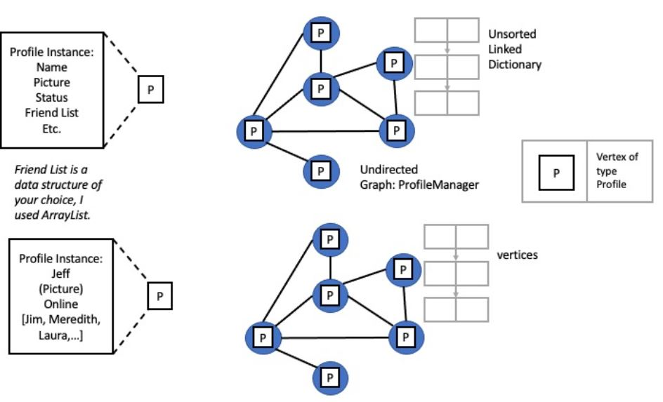

# Project 4: Social Media Network
**Purpose:** To practice and demonstrate proficiency in creating, manipulating and utilizing graphs as well as previous ADT models.

**Skills Used:** Java programming

**Knowledge Goals:** Graphs, previous ADT models

## Summary
For this project, you will be designing and implementing an application that maintains the data for a social media network. Each person in the network should have a profile that contains the person's name, optional image, current status and a list of their friends. This application you design should allow a user to join the network (by creating a profile), leave the network (by removing the profile), modify the profile, display all of the profiles (and add a friend from a list), add a friend, see a list of their friends, see a list of their friend's friends, and change the current user.

## Tasks:
1. Ensure your ADT Package and Graph Package is imported and test it.
2. Create your Profile class.
3. Create your ProfileManager class.
4. Implement your functionality:
    1. Join the network
    2. Modify the profile
    3. Display all the profiles (add friend from displayed list)
    4. Ensure another profile can be added, not just the initial one
    5. Add a friend
    6. See list of current user's friends
    7. Delete a profile
    8. See a list of the current user's friends friends
5. Test your work
    * Set up a Menu type output (see output below)

### Part 1: UML Class Diagram
Create a UML class diagram of the project. Because our projects are not large in scope, these UML diagrams will sometimes be pretty simple. Use any of the UML creators I offered as options on Canvas. Please submit the UML Class Diagram as either PDF or image file such as JPG, PNG, etc. Please use the tutorial given in the Prelude of the book as an example. The ADT Package does not need to be included with this UML.

### Part 2: Java Implementation
Packages, Interfaces and Classes
* ADTPackage
    * DictionaryInterface
        * LinkedDictionary
    * ListInterface
        * ListWithIteratorInterface
            * LinkedListWithIterator
    * MaxHeapInterface
        * MaxHeap
    * PriorityQueueInterface
        * HeapPriorityQueue
        * PriorityQueue
    * QueueInterface
        * LinkedQueue
    * StackInterface
        * LinkedStack
* GraphPackage
    * GraphInterface
        * BasicGraphInterface
        * GraphAlgorithmsInterface
        * DirectedGraph
            * UndirectedGraph (extends DirectedGraph)
    * VertexInterface
        * Vertex
* No package necessary for the remaining files (unless you want to)
    * Profile
       * Holds information about users
    * ProfileManager
        * Manages the profiles in the undirected graph
    * Main
        * Where you run the experiment

If you feel that other classes would benefit your project, you are free to add more.

The interface files should be the same as the one used in class.

You are not required to use/have all the ADT packages listed above if your implementation doesn't need it.

### Profile should be able to:
* Create a profile with a picture (optional), name, status and a list of friendProfiles.
    * Feel free to add whatever you like here including location, relationship status, age, occupation - whatever you want!
* Retrieve the profile picture (optional)
* Set and get the name of the profile
* Set and get the status
* Add a friend
* Print out all the details of the profile including the list of friends

### ProfileManager should be able to:
* Create an undirected graph
* Add a profile to an undirected graph
* Connect two vertexes on the graph (create a friendship between profiles)
* Display all of the profiles
* Display each profile's information and friends (through a breadth first traversal)
* Somewhere, a method should exist that can remove a profile

### Layout

### Output
Your output will be in the format of a menu that will simulate a user interacting with the social media system. The difference is they will have admin rights to create new profiles, delete anyone's profile, etc. Please have it during initial run of your program, the user must create a profile and set a variable to contain the current user. Maintain this variable so current user can always be determined (and switched). Your menu should contain the following. It can be in whatever order or wording you want:
* Modify profile
* View all profiles (and add a friend from the list)
* Add a friend
* View your friend list
* View your friend's friend list
* Delete a profile
* Add another profile
* Switch the current user
* Logout (end program)

Whoever runs your program will interact with it by typing things in. Ensure you provide information on what input is expected.

You can choose how you want it to display these. Be creative and ambitious!

### Extra Credit

I will award a variable amount of extra credit if the undirected graph is implemented with weights where an edge has a weight of 1 if they are a Close Friend and 0 if they are not a close friend. Create a method to display the close friend list. Please indicate in a comment that you added this functionality and test it by adding an option to see close friends list in the main menu.

### Helpful Hints:
* It is better to submit something that does most of what is necessary than nothing at all. Do not get lost in the details. If you are struggling, produce a basic version and be okay with that. This can be a complex project.
* Keep an eye on what these data structures are made up of. For instance, the undirected graph inherits the directed graph, which is actually the implementation of a LinkedDictionary. There are layers and layers of data structures here. Be aware of them.
* The undirected graph will hold the new profiles but unless they are friends, there will be no edge between them. That can mean you could add 10 profiles and it would be a graph with no edges. You cannot traverse a graph with no edges. This is why I suggest an auxiliary data structure to hold the created profiles so that a list of the existing profiles can be displayed to the user to choose to add friends from.
* When deleting a profile, ensure it is gone from all data structures that are relevant. Ensure it is not on anyone's friend list or in the main list of all profiles.

### Some other items of importance:
* Use javadoc comments on your functions to explain what they do. You do not have to do this in the class implementations where there is an interface, you can use @inheritDoc.
* Be sure your code is clean, legible and easy to read.
* Feel free to go above and beyond!  Add new methods and functionality, test in different ways in addition to what you are required to do, be creative! The top grades go to those who go above and beyond. Strive for excellence.
* You are not required to create unit tests but are welcome to do so if you wish.
* Including the runtime as a comment on algorithms with loops in them will be seen as going above and beyond as well.

## Format Requirements
Please ensure you follow the structure as listed above. Use IntelliJ to do your work. Use Javadoc comments where appropriate.
Ensure that your UML diagram submission is in PDF or an image file format.

## Assessment
Please see the Rubric attached for assessment.

## Deliverables
* Please add your UML documents to your Git repository. I will look for them there.
* Submit a link to your Git repository. Make sure to add me as a collaborator, so I can see your code.
* Each partner should submit a link. This is to ensure both partners don't forget to write a reflection of their partnership in Canvas.